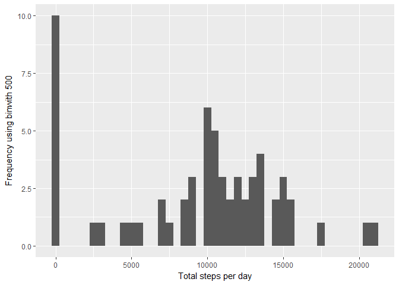

Reproducible research project 1
===============================

Loading packages
----------------

    library(ggplot2)
    library(scales)
    library(Hmisc)

    ## Loading required package: lattice

    ## Loading required package: survival

    ## Loading required package: Formula

    ## 
    ## Attaching package: 'Hmisc'

    ## The following objects are masked from 'package:base':
    ## 
    ##     format.pval, units

Setting up the data
-------------------

    Data_On_Activity <- read.csv("H:/Rstudio/Data/Coursera_R_Course5/Reproducible research project 1/activity/activity.csv")

Question 1: What is mean total number of steps taken per day?
-------------------------------------------------------------

    StepsPerDay <- tapply(Data_On_Activity$steps, Data_On_Activity$date, sum, na.rm=TRUE)

### Histrogram of steps taken per day

    qplot(StepsPerDay, xlab='Total steps per day', ylab='Frequency using binwith 500', binwidth=500)

### Mean and median total number of steps taken per day

    StepsPerDayMean <- mean(StepsPerDay)
    StepsPerDayMedian <- median(StepsPerDay)

    StepsPerDayMean

    ## [1] 9354.23

    StepsPerDayMedian

    ## [1] 10395

Question 2: What is the average daily activity pattern?
-------------------------------------------------------

    AverageStepsPerTimeInterval <- aggregate(x=list(meanSteps=Data_On_Activity$steps), by = list(interval=Data_On_Activity$interval), FUN=mean, na.rm=TRUE)

### Time series plot

    ggplot(data=AverageStepsPerTimeInterval, aes(x=interval, y=meanSteps)) +
        geom_line() +
        xlab("Interval of 5 minutes") +
        ylab("Average amount of steps taken") 

### 5-minute interval with most steps

    MostSteps <- which.max(AverageStepsPerTimeInterval$meanSteps)
    TimeMostSteps <-  gsub("([0-9]{1,2})([0-9]{2})", "\\1:\\2", AverageStepsPerTimeInterval[MostSteps,'interval'])
    TimeMostSteps

    ## [1] "8:35"

Question 3: Imputing missing values
-----------------------------------

### Total number of missing values in the dataset

    numMissingValues <- length(which(is.na(Data_On_Activity$steps)))
    numMissingValues

    ## [1] 2304

### Filling in all of the missing values in the dataset

Creating a new dataset equal to the original dataset but filled with
NAs.

    ActivityDataImputed <- Data_On_Activity
    ActivityDataImputed$steps <- impute(Data_On_Activity$steps, fun=mean)

Making a histogram of the total number of steps taken each day

    StepsByDayImputed <- tapply(ActivityDataImputed$steps, ActivityDataImputed$date, sum)
    qplot(StepsByDayImputed, xlab='Imputed total steps per day', ylab='Frequency (binwith 500)', binwidth=500)

Computing mean and median total number of steps taken per day.

    StepsByDayMeanImputed <- mean(StepsByDayImputed)
    StepsByDayMedianImputed <- median(StepsByDayImputed)
    StepsByDayMeanImputed

    ## [1] 10766.19

    StepsByDayMedianImputed

    ## [1] 10766.19

Question 4: Are there differences in activity patterns between weekdays and weekends?
-------------------------------------------------------------------------------------

### New factor variable in the dataset with two levels – “weekday” and “weekend” as an indication

    ActivityDataImputed$dateType <-  ifelse(as.POSIXlt(ActivityDataImputed$date)$wday %in% c(0,6), 'weekend', 'weekday')

### Panel plot containing a time series plot

    AveragedActivityDataImputed <- aggregate(steps ~ interval + dateType, data=ActivityDataImputed, mean)
    ggplot(AveragedActivityDataImputed, aes(interval, steps)) + 
        geom_line() + 
        facet_grid(dateType ~ .) +
        xlab("Interval of 5 minutes") + 
        ylab("Avarage amount of steps")

